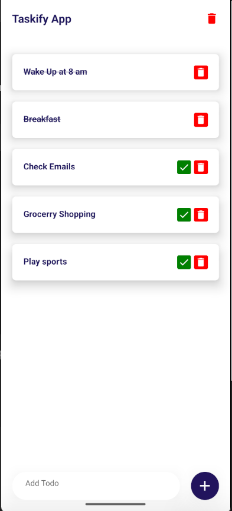

# 📝 Taskify App

A simple and efficient to-do app built with **React Native CLI**, featuring **React Native Vector Icons** for a clean and stylish UI, and **React Native Async Storage** for persistent task management.
## ✨ Features

- 📋 Create, delete, and manage your daily tasks
- ✅ Mark tasks as completed
- 💾 Persistent storage with AsyncStorage
- 🎨 Modern and intuitive UI using React Native Vector Icons

---
## 🚀 Tech Stack

- [React Native CLI](https://reactnative.dev/docs/environment-setup)
- [React Native Vector Icons](https://github.com/oblador/react-native-vector-icons)
- [React Native Async Storage](https://react-native-async-storage.github.io/async-storage/)
## 📱 Screenshot




## 🔧 Installation

To get started with the Simple Todo App, follow these steps:

1.  **Clone the repository:**

    ```bash
    git clone https://github.com/Sonuku4564/Taskify.git

    cd Taskify
    ```

2.  **Install all dependencies:**

    ```bash
    npm install
    ```

3.  **Install CocoaPods (for iOS only):**

    ```bash
    cd ios && pod install && cd ..
    ```

4.  **Run the app on Android:**

    ```bash
    npx react-native run-android
    ```

5.  **Run the app on iOS:**

    ```bash
    npx react-native run-ios
    ```
## 🤝 Contributing

Pull requests are welcome! For major changes, please open an issue first to discuss what you would like to change.


## 📄License

This project is licensed under the MIT License.


## 👤 Author

- Sonu Kumar


